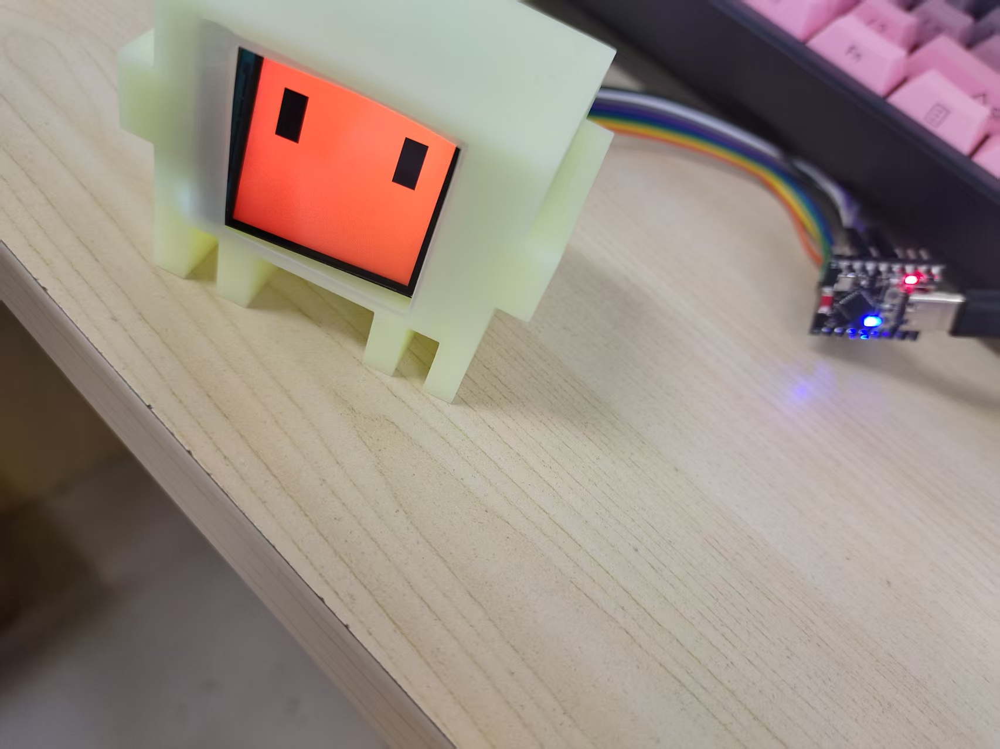

# Clawd-Mochi-ESP32C3
ESP32-C3 SuperMini + ST7789 240×240 屏，AP 网页控制动画 / 终端 / 手绘；优化过热降功耗，附带 3D 打印外壳文件

# 🖥️ ESP32-C3 SuperMini + ST7789 桌面智能萌系显示屏

> 一个带 WiFi 网页控制、动态眼睛动画、手机画布、自动熄屏降温的桌面小萌物。  
> **专门修复了 ESP32-C3 SuperMini 发热断WiFi 的固件级优化，复现零坑。**

   <!-- 请替换为你自己的照片 -->

---

## ✨ 特性

- ✅ **WiFi AP 网页控制** – 手机直连，无需路由器
- ✅ **动态眼睛动画 + 挤压表情** – 可爱互动
- ✅ **Claude Code 开机动画** – 极客风
- ✅ **网页终端** – 通过浏览器直接发送指令
- ✅ **手机手绘画布** – 实时显示涂鸦
- ✅ **自定义配色 / 动画速度** – 按心情调节
- ✅ **45秒自动熄屏** – 芯片降温、省电
- ✅ **修复** – SuperMini 过热导致 WiFi 消失、射频保护、按压才联网等通病

---

## 🛠️ 硬件与外壳

### 硬件清单

| 组件 | 型号 / 规格 |
|------|-------------|
| 主控 | ESP32-C3 SuperMini（超薄版） |
| 屏幕 | ST7789 240×240 像素，SPI 接口 |
| 连接线 | 母对母杜邦线 ×8 |
| 散热片（可选） | 小型铝制散热片（推荐，降低芯片温度） |
| 外壳 | 3D 打印（树脂或PLA） |

### 3D打印外壳（嘉立创免费打印）

1. **打印平台** – [嘉立创3D打印](https://www.jlc.com/3dprint)，使用免费券  
2. **材料选择**  
   - 免费券只能用 **树脂**：精度高、光滑，但夏季偏脆，避免摔落  
   - 自费可选 **PLA**：韧性更好，适合批量凑单  
3. **模型分割**（免费券尺寸有限，需分割）  
   - 方法一：用建模软件手动切割  
   - 方法二（推荐小白）：[在线 STL-Spliter](https://example.com) 一键切为上下壳  
4. 打印后 **直接卡扣组装**，无需胶水（已预留公差）

### 硬件接线表

| ST7789 屏幕引脚 | → | ESP32-C3 SuperMini 引脚 |
|----------------|----|--------------------------|
| SDA            | → | GPIO10                   |
| SCL            | → | GPIO8                    |
| RST            | → | GPIO2                    |
| DC             | → | GPIO1                    |
| CS             | → | GPIO4                    |
| BL             | → | GPIO3                    |
| VCC            | → | 3.3V                     |
| GND            | → | GND                      |

> ⚠️ **严重警告**：VCC 严禁接 5V！会烧毁屏幕！

---

## ⚙️ 软件环境搭建

### Arduino IDE 配置

1. 添加 ESP32 开发板支持  
   - 文件 → 首选项 → 附加开发板管理器网址  
     `https://dl.espressif.com/dl/package_esp32_index.json`  
   - 工具 → 开发板 → 开发板管理器 → 搜索 `esp32` → 安装官方库

2. 选择开发板：**ESP32C3 Dev Module**

3. 如果联网失败/下载慢  
   → 使用 [ESP32 本地离线安装包](https://github.com/espressif/arduino-esp32/releases) 手动部署

### 所需库

在 Arduino IDE 库管理器中搜索并安装：

- `Adafruit GFX Library`
- `Adafruit ST7789 Library`  
- （WiFi、WebServer 为 ESP32 自带，无需额外安装）

> 📌 测试通过的版本已锁定在 `libraries.txt` 中，若编译报错可参考。

---

## 🔥 ESP32-C3 SuperMini 发热与WiFi问题（必读）

### 问题根源

**ESP32-C3 SuperMini** 由于板型极度紧凑、无散热铜皮，高负载时芯片严重发烫，触发以下保护：

- WiFi 信号消失，搜不到热点
- 射频自动断电保护
- 需要用手按压才能联网（高温虚焊 + 过热双重故障）

### 本项目已做的部分代码修改

上传的固件全面优化：

- 关闭 WiFi 全速满载模式，**启用智能休眠**
- CPU 增加空闲延时，避免 100% 满载发热
- **屏幕 45 秒无操作自动熄背光**（最大降温项）
- 修复内存碎片与终端字符溢出
- 降低 SPI 屏幕频率，减少高频发热，最终还是有点热-通病了属于

### 硬件终极方案（建议）

- 在芯片顶部粘贴 **小型铝制散热片**（淘宝几块钱）  
- 彻底杜绝「手压才能联网」的问题

> ℹ️ 补充：普通版 ESP32-C3（非 SuperMini）非本项目使用模块，不确定是否仅超薄版存在该问题。

---

## 📲 烧录与开机使用

1. 用 USB 线连接 ESP32-C3 SuperMini 到电脑  
2. Arduino IDE 中选择正确 **COM 端口**  
3. 点击 **上传** 按钮，等待烧录完成  
4. 开机后等待 Claude Code logo 动画播放完毕  
5. 手机连接 WiFi：  
   - **SSID**：`ClaWD-Mochi`  
   - **密码**：`clawd1234`  
6. 浏览器打开 **`192.168.4.1`**，即可使用所有网页功能（眼睛动画、终端、画布、调色等）

  <!-- 请替换实际截图 -->

---

## 📂 项目文件说明

| 路径 | 说明 |
|------|------|
| `/src/` | Arduino 完整源码（已做发热/内存/稳定性优化） |
| `/stl/` | 3D 打印外壳模型（分割好的上下壳） |
| `/docs/` | 更多说明（接线图、FAQ） |
| `README.md` | 你现在看的这份文档 |

---
